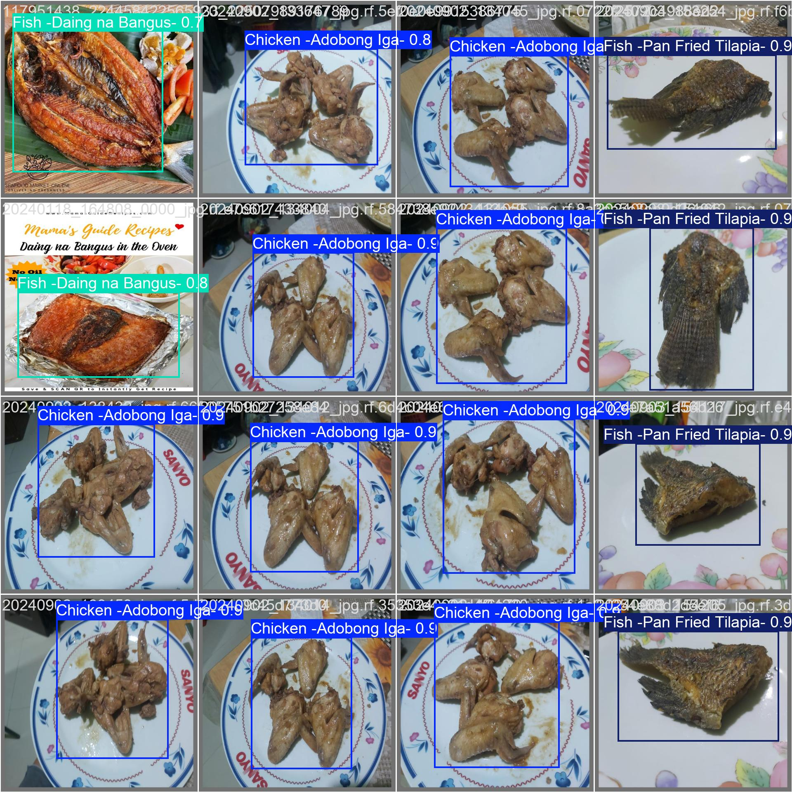
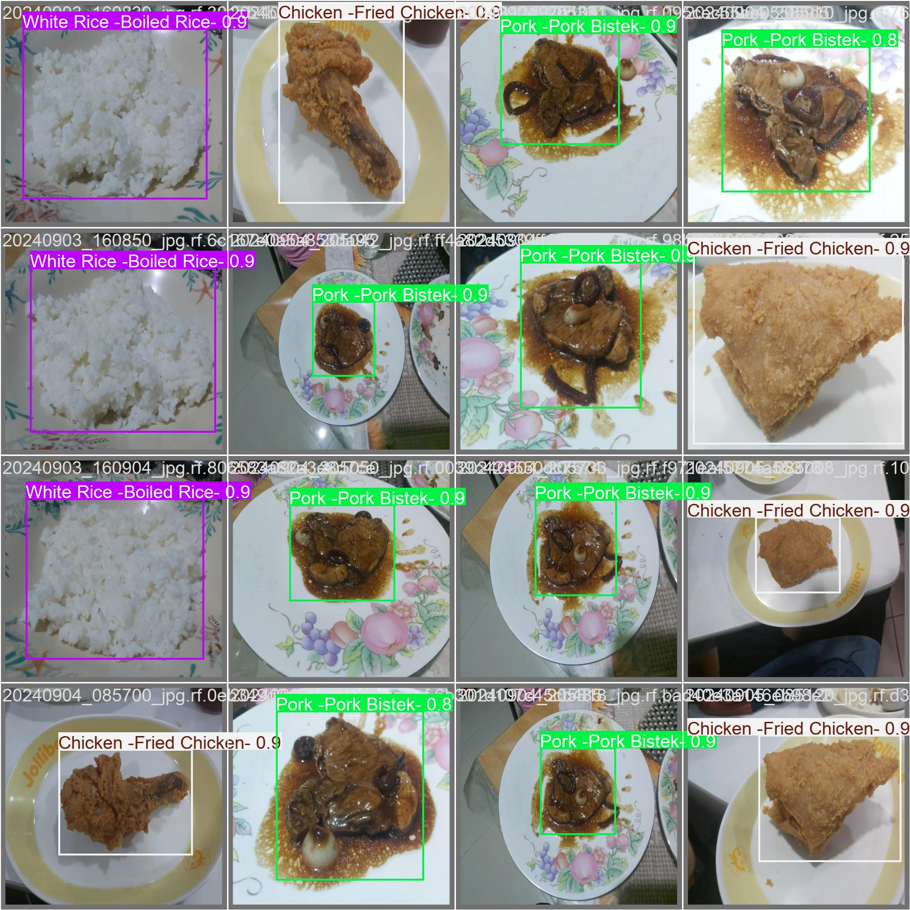
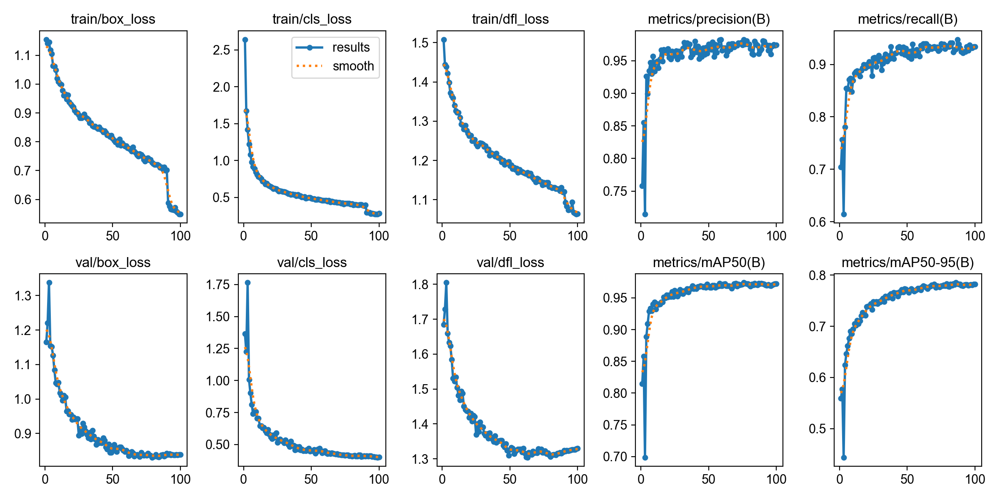
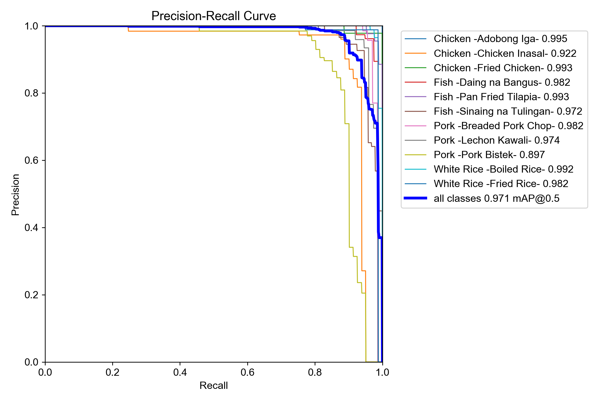
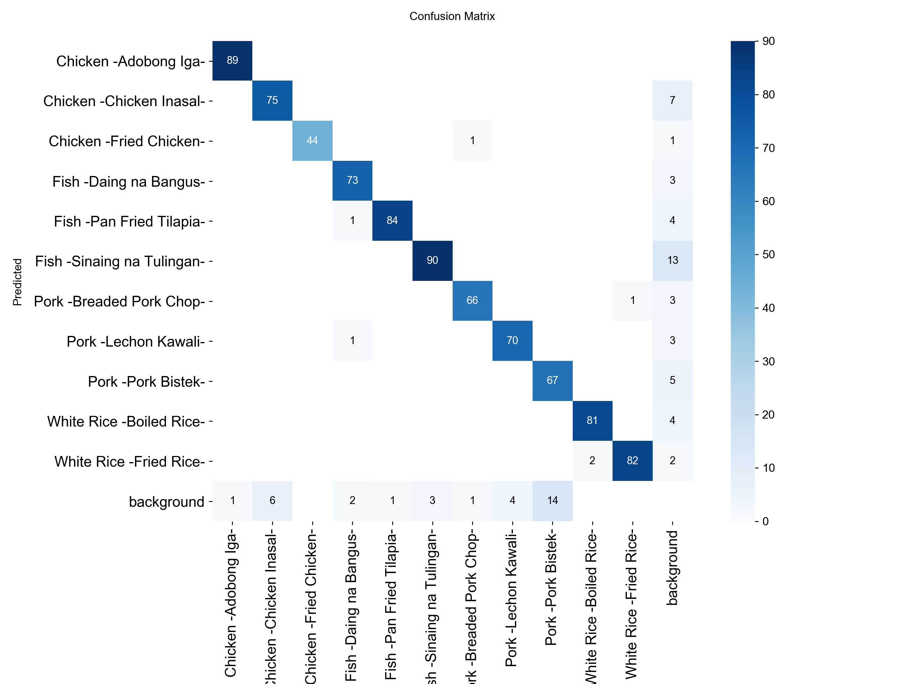

# KaonCheck

KaonCheck is a local web app for scanning Filipino food from an image or camera feed. It uses a YOLOv8 object detection model to identify supported dishes, then shows scan details and practical nutrition guidance.

The project includes a FastAPI backend, a browser UI, YOLO training artifacts, and an optional local nutrition chat assistant powered by Ollama.

## What It Shows

- Computer vision model integration with FastAPI
- Image upload and live camera scanning
- Bounding box rendering in the browser
- Per-scan confidence, inference time, and detection details
- Validation metrics from the trained YOLO run
- Local LLM integration for nutrition questions
- Clear separation between prediction results and model evaluation metrics

## Results

Sample detections from the validation set:

| Sample 1 | Sample 2 |
|---|---|
|  |  |

Training results:



Precision-recall curve:



Confusion matrix:



## Features

- Upload a food photo for analysis
- Open the camera for live scanning
- View detected dish names, confidence scores, and bounding boxes
- Open model metrics for precision, recall, F1-score, mAP, training curves, and confusion matrix
- Get rule-based nutrition notes for detected dishes
- Ask follow-up nutrition questions through Yobab, the local chat assistant

## Tech Stack

- Python
- FastAPI
- Ultralytics YOLOv8
- Ollama with `llama3.1`
- HTML, CSS, JavaScript

## Model

| Item | Detail |
|---|---|
| Model | YOLOv8n |
| Task | Object detection |
| Weights | `runs/detect/kaoncheck-4/weights/best.pt` |
| Training run | `runs/detect/kaoncheck-4` |
| Dataset config | `dataset/data.yaml` |
| Classes | 11 |

## Supported Classes

| ID | Class |
|---:|---|
| 0 | Adobong Iga |
| 1 | Chicken Inasal |
| 2 | Fried Chicken |
| 3 | Daing na Bangus |
| 4 | Pan Fried Tilapia |
| 5 | Sinaing na Tulingan |
| 6 | Breaded Pork Chop |
| 7 | Lechon Kawali |
| 8 | Pork Bistek |
| 9 | Boiled Rice |
| 10 | Fried Rice |

## Model Performance

Metrics are from `runs/detect/kaoncheck-4/results.csv`.

| Metric | Score |
|---|---:|
| Precision | 97.46% |
| Recall | 93.41% |
| F1-score | 95.39% |
| mAP50 | 97.21% |
| mAP50-95 | 78.26% |

Per-upload confidence is the model score for one prediction. Precision, recall, F1-score, and mAP are validation-set metrics across the trained dataset.

## Architecture

```text
Image upload or camera frame
        |
        v
FastAPI /analyze
        |
        v
YOLOv8 detection
        |
        v
Browser result with boxes and scan details
        |
        v
Optional Yobab nutrition chat through /advisor/stream
```

## Setup

Install dependencies:

```bash
pip install -r requirements.txt
```

Install the local chat model:

```bash
ollama pull llama3.1
```

Run the app:

```bash
uvicorn main:app --host 127.0.0.1 --port 8000
```

Open:

```text
http://127.0.0.1:8000
```

## Limitations

- Not a medical diagnosis tool
- Limited to the 11 trained food classes
- Detection quality depends on lighting, angle, occlusion, and image clarity
- Nutrition guidance is general and should not replace a licensed professional

## Future Work

- Add more Filipino dish classes
- Add portion-size estimation
- Improve mobile camera scanning
- Add dataset version tracking
